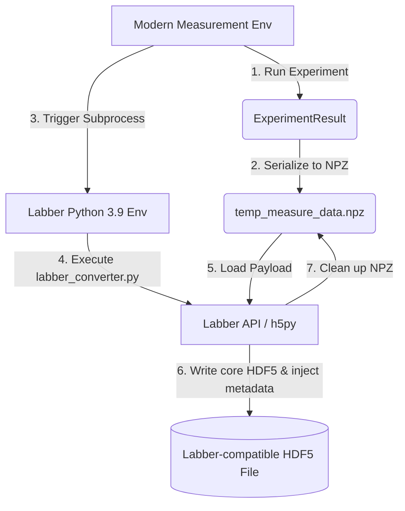

# Developer Interface Manual: Labber HDF5 Decoupled Subprocess Converter

This manual details the architecture, payload format, sweep mappings, and instructions for extending the decoupled data logging module within the QAWG package.

---

## 1. Architectural Overview

To resolve Python version conflicts between our modern measurement environment and the older Python 3.9 environment required by the official Labber API, we use a **Decoupled Subprocess Architecture (Conversion Intermediate Layer)**:



1. **Modern Environment**: Serializes the sweeps, traces, config dictionary, and results to a temporary `temp_measure_data.npz` file and invokes `labber_converter.py` using `subprocess.run()`.
2. **Labber Python Environment**: The lightweight converter script loads the `.npz` payload, executes the core Labber API logic to write the dataset arrays, and uses `h5py` in `r+` mode to write additional instrument config attributes.

---

## 2. Payload Structure of `temp_measure_data.npz`

The intermediate `.npz` file is written by `hdf5_writer.py` using `np.savez`. The following table lists the variables included in the payload:

| Variable Name | Type / Dtype | Shape | Description |
| :--- | :--- | :--- | :--- |
| `sweep_names` | `object` (strings) | `(M,)` | Names of the sweep axes (e.g. `['Repetition', 'frequency', 'power']`). |
| `sweep_shapes` | `int32` | `(M,)` | Length of each sweep dimension. |
| `average_mode` | `bool` | Scalar | If `True`, trace arrays are averaged over repetitions. |
| `readout_name` | `str` | Scalar | Designated readout channel label (e.g. `'ro'`). |
| `comment` | `str` | Scalar | User comment to write to root attribute `comment`. |
| `project` | `str` | Scalar | Project name tag. |
| `user` | `str` | Scalar | User name tag. |
| `filepath` | `str` | Scalar | Path to output HDF5 file. |
| `sweep_val_<name>` | `float64` | `(S_k,)` | Unique coordinate array for the sweep named `<name>`. |
| `iq_traces` | `complex128` | `(n_avg, steps, iq_samples)` | Complex IQ trace measurements (optional). |
| `iq_time_s` | `float64` | `(iq_samples,)` | Time axis values for IQ traces (optional). |
| `raw` | `float64` | `(n_avg, steps, raw_samples)` | Real raw trace measurements (optional). |
| `raw_time_s` | `float64` | `(raw_samples,)` | Time axis values for raw traces (optional). |
| `iq_shots` | `complex128` | `(n_avg, steps)` | Integrated complex shot coordinates (optional). |
| `cfg_json` | `str` (JSON) | Scalar | Serialized configuration dictionary `cfg` (optional). |
| `initial_trigger_delay_s`| `float64` | Scalar | Dynamic result trigger delay (optional). |
| `acquire_window_s` | `float64` | Scalar | Dynamic result acquisition window (optional). |
| `remove_dc_offset` | `bool` | Scalar | Dynamic DC offset subtraction flag (optional). |

---

## 3. Dimensionality & Sweep Coordinate Mapping

### 3.1. Loop Hierarchy mapping
Labber's multi-dimensional sweep grid requires step channels to be ordered from **innermost loop (fastest changing)** to **outermost loop (slowest changing)**. 

1. **Time Axis**: The trace axis (`Time`) is always the **innermost** coordinate (first element of `step_channels`). This satisfies Labber's constraint that the trace length is defined by the first item in the step channels, allowing corresponding log channels to configure `vector=False`.
2. **Sweep Axes**: The experimental sweep dimensions are placed after `Time`, ordered from fastest to slowest sweep speed. Since the `sweep_names` in `.npz` are serialized from slowest to fastest, the converter reverses their order to construct the step list.

Thus, the final sequence in `step_channels` is:
$$\text{step\_channels} = [\text{Time}, \text{FastestSweep}, \dots, \text{SlowestSweep}]$$

### 3.2. Sequential Trace Feeding
Instead of passing all sweep coordinates and flattening the entire multi-dimensional dataset into a single massive array, the Labber API expects `addEntry` to be called sequentially in a loop—once for each experimental sweep point (total of $N_{\text{sweeps}} = \prod S_j$ steps).

- **Loop Iteration**: The script reshapes trace grids of shape `(*sweep_shapes, max_L)` to `(N_sweeps, max_L)`. It then iterates through the $N_{\text{sweeps}}$ configurations.
- **Trace Payload**: At each sweep point, the dictionary passed to `addEntry` contains only the active logged channels, mapping each channel to its corresponding 1D trace slice of size `max_L`.
- **Automatic Step Advancement**: Labber automatically advances the step channels (sweep axes) in the background on each `addEntry` call. Thus, sweep axis coordinates and `Time` coordinates do not need to be passed in the `addEntry` payload.

### 3.3. Heterogeneous Trace Padding
When different channels have different record sizes (e.g. `demodulated trace` of size 120, `raw trace` of size 250, and `integrated IQ` of size 1):
1. The converter determines the maximum length $L_{\text{max}} = \max(L_{\text{demod}}, L_{\text{raw}}, L_{\text{shot}})$.
2. The `Time` step channel values array is constructed with size $L_{\text{max}}$.
3. All measurement data arrays are padded to $L_{\text{max}}$ along the trace dimension with `np.nan` (or `np.nan + np.nan * 1j` for complex data) before they are flattened and written.

---

## 4. Developer Guide: Extending the Interface

### 4.1. Adding a New Sweep Dimension
If you configure a new sweep axis in the measurement environment, it is automatically captured by `result.axes`.
1. `hdf5_writer.py` automatically packages the axis into `sweep_names` and `sweep_val_<name>`.
2. No modifications are needed in `labber_converter.py` for standard sweeps.

### 4.2. Adding a New Logged Quantity / Trace
To log a new measured quantity:
1. Update `hdf5_writer.py` to write the new data to the `.npz` payload (e.g., `payload["my_quantity"] = result.my_quantity`).
2. Update `labber_converter.py` to check for its presence, define its log channel dictionary, pad it to `max_L`, and add its flattened array to `entry_data`:
   ```python
   # Inside labber_converter.py
   has_my_qty = "my_quantity" in payload
   my_qty = payload["my_quantity"] if has_my_qty else None
   
   # Declare log channel
   if has_my_qty:
       log_channels.append({
           'name': f"{readout_name} - My Quantity",
           'unit': 'V',
           'vector': False,
           'complex': False,
           'instrument': 'AlazarTech ATS9371 at localhost'
       })
       
   # Pad and flatten
   my_qty_grid = my_qty.reshape(tuple(sweep_shapes) + (my_qty.shape[-1],))
   my_qty_padded = pad_trace_data(my_qty_grid, max_L, is_complex=False)
   entry_data[f"{readout_name} - My Quantity"] = my_qty_padded.flatten()
   ```

### 4.3. Logging Configuration for New Hardware Instruments
Instrument metadata parameters in `cfg` are categorized using substring matching in `labber_converter.py`. If you add a new instrument:
1. Update the categorization loop in `labber_converter.py` to map its configuration keys:
   ```python
   # Example: Adding keys for a new microwave source 'mw_src'
   if "mw" in k_str or "source" in k_str or "power_mw" in k_str:
       mw_cfg[k] = v
   ```
2. Update the post-processing `h5py` writing block to create the new subgroup and write attributes:
   ```python
   if 'MyMWSource at localhost' not in inst_grp:
       mw_grp = inst_grp.create_group('MyMWSource at localhost')
   else:
       mw_grp = inst_grp['MyMWSource at localhost']
   for k, v in mw_cfg.items():
       mw_grp.attrs[str(k)] = clean_attr_value(v)
   ```
