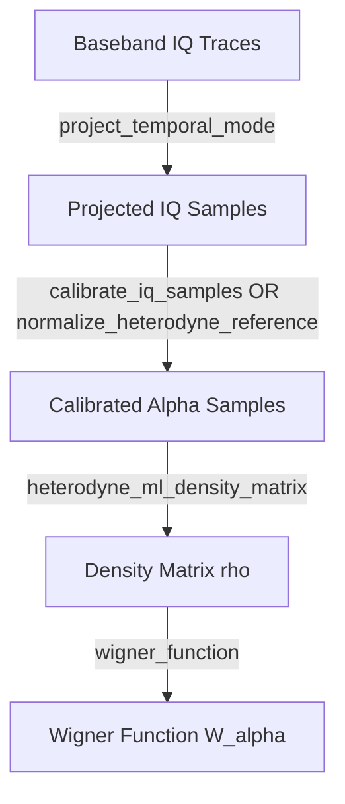

# QAWG Calibration & State Tomography (cal_tomo)

本文件詳細說明 `QAWG/tomography.py` 中提供的所有校正 (Calibration) 與量子狀態重建 (Tomography) 函數之物理原理、數學定義及 API 使用方法。

相關程式檔案：
- [tomography.py](file:///c:/Users/cluster/Desktop/custmon/QAWG/tomography.py)
- [test_tomography.py](file:///c:/Users/cluster/Desktop/custmon/tests/test_tomography.py)

---

## 1. 模組 API 概覽

`QAWG.tomography` 提供了從未加工的複數基頻訊號 (Complex Baseband) 投影至特定時間模式 (Temporal Mode)，並進行 IQ 平面校正、最大概似估計 (Maximum-Likelihood Estimation, MLE) 密度矩陣重建及 Wigner 函數繪製的完整工具鏈：



---

## 2. Temporal Mode Matching (時間模式匹配)

 traveling microwave mode 在連續時間中是由一系列的時變場算符 $\hat a_{\rm out}(t)$ 所描述。為將其視為單一的 Bosonic Mode，我們必須定義一個正規化的時間權重函數 $f(t)$：

$$\hat a_f = \int dt \, f^*(t) \hat a_{\rm out}(t), \quad \text{其中} \int dt \, |f(t)|^2 = 1$$

在離散採樣的實驗數據中，我們透過與權重數組 $f_n$ 做內積 (Dot Product) 來進行投影：

$$S_k = \sum_n f_n^* z_{k,n}, \quad \text{其中} \sum_n |f_n|^2 = 1$$

### 2.1 產生時間權重：`temporal_mode_weights`
根據物理源的衰減特性，選擇適當的時間模式。

```python
def temporal_mode_weights(
    number_of_samples: int,
    *,
    kind: str = "boxcar",
    sigma_samples: float | None = None,
    decay_samples: float | None = None,
) -> ComplexArray:
```
* **參數說明**：
  * `number_of_samples`: 權重數組的長度（採樣點數）。
  * `kind`: 模式類型，支援 `"boxcar"`、`"gaussian"` (或 `"gauss"`)、`"exponential"` (或 `"exp"`)。
  * `sigma_samples`: Gaussian 模式的標準差 $\sigma$（單位：samples）。
  * `decay_samples`: Exponential 模式的場振幅衰減常數（單位：samples）。
* **回傳**：正規化後的複數權重數組（$L^2$-norm 為 1）。

> [!NOTE]
> 對於腔體自由衰減的場振幅，若能量衰減時間（Lifetime）為 $T_1$，則場振幅的衰減模式為 $e^{-t/(2T_1)}$。是以 `decay_samples` 對應的數值為 $T_1 \times f_s$，此函數在內部計算時會自動代入分母的因子 $2.0$： `weights = np.exp(-sample / (2.0 * decay))`。

### 2.2 投影計算：`project_temporal_mode`
將每個 shot 的複數時序波形投影至選定的時間模式。

```python
def project_temporal_mode(
    baseband_iq: npt.ArrayLike,
    weights: npt.ArrayLike,
    *,
    start_sample: int = 0,
) -> ComplexArray:
```
* **參數說明**：
  * `baseband_iq`: 形狀為 `(shots, samples)` 的複數基頻訊號陣列。
  * `weights`: 剛才產生的正規化時間權重。
  * `start_sample`: 投影對齊的起始 sample 索引。
* **回傳**：形狀為 `(shots,)` 的複數投影 IQ 點。

---

## 3. IQ 平面與相干振幅校正 (Calibration)

從投影中得到的原始複數點其物理單位為 $\text{Volt} \cdot \text{sample}$，並非無因次的相干態場振幅 $\alpha$。本模組提供兩種校正方式：

### 3.1 相干位移校正：`calibrate_iq_samples`
使用一個已知的相干驅動位移（如輸入 Coherent State）來定標 IQ 平面的 Gain 與 Offset。

```python
def calibrate_iq_samples(
    reference_samples: npt.ArrayLike,
    signal_samples: npt.ArrayLike,
    *,
    target_alpha: complex = 1.0 + 0.0j,
) -> tuple[ComplexArray, ComplexArray, complex, complex]:
```
* **映射邏輯**：
  * 使得 Reference 的平均值變為 $0$： $\langle \alpha_{\rm ref} \rangle = 0$。
  * 使得 Signal 與 Reference 的位移差剛好等於給定的無因次振幅 `target_alpha`： $\langle \alpha_{\rm sig} \rangle - \langle \alpha_{\rm ref} \rangle = \alpha_{\rm target}$。
* **回傳**： `(calibrated_reference, calibrated_signal, offset, gain)`。

### 3.2 雜訊常規化校正：`normalize_heterodyne_reference`
將 Reference 訊號中心化，並將其變異數（Variance）調整為 $1$，這符合理想異頻（Heterodyne）測量下的真空漲落（Vacuum Fluctuations）定義。

```python
def normalize_heterodyne_reference(
    reference_samples: npt.ArrayLike,
    *sample_sets: npt.ArrayLike,
) -> tuple[ComplexArray, tuple[ComplexArray, ...], complex, float]:
```
* **映射邏輯**：
  * 使得 Reference 的平均值變為 $0$。
  * 使得 $\langle |\alpha_{\rm ref}|^2 \rangle = 1$（包含實部與虛部變異數各為 $1/2$ 的真空雜訊）。
* **回傳**： `(normalized_reference, (normalized_signals...), offset, scale)`。

> [!WARNING]
> 室溫下量測到的電子雜訊遠大於真空起伏。此函數僅提供數值常規化。若要獲得具備量子物理意義的真實光子數與 Wigner Negativity，必須在低溫下結合真實放大器雜訊溫度等 Calibration。

---

## 4. 最大概似度密度矩陣重建 (Tomography)

在異頻（Heterodyne）測量中，複數投影點的統計分布直接對應於 Husimi $Q$ 函數：

$$p(\alpha | \rho) = Q(\alpha) = \frac{1}{\pi} \langle \alpha | \rho | \alpha \rangle$$

其中相干態被截斷至 Fock 空間的 Cutoff 大小 $N_c$：

$$|\alpha\rangle = e^{-|\alpha|^2/2} \sum_{n=0}^{N_c-1} \frac{\alpha^n}{\sqrt{n!}}|n\rangle$$

### 4.1 Reconstructing $\rho$：`heterodyne_ml_density_matrix`
本函數使用稀釋後的 $R\rho R$ 迭代演算法 (Diluted $R\rho R$ iteration) 尋找最符合實驗樣本概似度的物理密度矩陣 $\rho$。

```python
def heterodyne_ml_density_matrix(
    samples: npt.ArrayLike,
    *,
    cutoff: int = 8,
    iterations: int = 200,
    dilution: float = 0.5,
    tolerance: float = 1e-9,
) -> ComplexArray:
```
* **演算法核心步驟**：
  1. 初始化為最大熵均勻矩陣： $\rho^{(0)} = \frac{1}{N_c} \mathbb{I}$。
  2. 計算每個樣本點在當前 $\rho$ 下的機率： $P_k = \langle \alpha_k | \rho | \alpha_k \rangle$。
  3. 計算算符 $R$：
     $$R = \frac{1}{M} \sum_{k=1}^M \frac{|\alpha_k\rangle\langle\alpha_k|}{P_k}$$
  4. 稀釋更新：
     $$\rho^{(t+1)} = \frac{(\mathbb{I} + \epsilon R)\rho^{(t)}(\mathbb{I} + \epsilon R)}{\operatorname{Tr}[(\mathbb{I} + \epsilon R)\rho^{(t)}(\mathbb{I} + \epsilon R)]}$$
     其中 $\epsilon$ 為 `dilution` 參數，能有效避免收斂過程中的數值不穩定。
* **回傳**：符合厄米性 (Hermitian)、半正定 (Positive Semi-definite) 且跡為 1 ($\operatorname{Tr}[\rho] = 1$) 的 $N_c \times N_c$ 複數密度矩陣。

---

## 5. Wigner 函數繪製 (Wigner Function)

Wigner 函數可以用位移後的宇稱算符 (Displaced Parity Operator) 之期望值表示：

$$W(\alpha) = \frac{2}{\pi} \operatorname{Tr} \left[ D(-\alpha) \rho D^\dagger(-\alpha) \Pi \right]$$

其中：
* $D(\alpha) = e^{\alpha a^\dagger - \alpha^* a}$ 為位移算符 (Displacement Operator)。
* $\Pi = (-1)^{a^\dagger a}$ 為宇稱算符 (Parity Operator)。

### 5.1 計算 Wigner 圖：`wigner_function`
```python
def wigner_function(
    density_matrix: npt.ArrayLike,
    x: npt.ArrayLike,
    y: npt.ArrayLike,
) -> FloatArray:
```
* **參數說明**：
  * `density_matrix`: 重建的 $\rho$ 矩陣。
  * `x`: 實部（$X$ 軸）坐標陣列。
  * `y`: 虛部（$P$ 軸）坐標陣列。
* **回傳**： `(len(y), len(x))` 的實數陣列，即二維平面上的 Wigner 函數值 $W(X, P)$。

---

## 6. 完整使用範例

以下展示從 Alazar 原始 records 開始，進行投影、校正、重建 $\rho$、計算 Photon Population 及繪製 Wigner 函數的完整流程：

```python
import numpy as np
import matplotlib.pyplot as plt
from QAWG.alazar import AlazarProcessor, digital_downconvert
from QAWG.tomography import (
    temporal_mode_weights,
    project_temporal_mode,
    normalize_heterodyne_reference,
    heterodyne_ml_density_matrix,
    wigner_function
)

# 1. 參數定義
sample_rate_hz = 1e9
if_frequency_hz = 50e6
decay_s = 200e-9       # 腔體 T1
cutoff_fock = 8        # Fock 截斷大小

# 模擬數據或讀取結果 (raw_records 形狀: (shots, samples))
# signal_records, reference_records = ...

# 2. 數位混頻及濾波 (DDC & LPF)
ref_bb = digital_downconvert(reference_records, sample_rate_hz, if_frequency_hz)
sig_bb = digital_downconvert(signal_records, sample_rate_hz, if_frequency_hz)

processor = AlazarProcessor(sample_rate_hz)
ref_bb = processor.apply_butterworth_lpf(ref_bb, cutoff_hz=20e6, order=4)
sig_bb = processor.apply_butterworth_lpf(sig_bb, cutoff_hz=20e6, order=4)

# 3. 建立時間模式並進行投影
n_samples = ref_bb.shape[1]
weights = temporal_mode_weights(
    n_samples,
    kind="exponential",
    decay_samples=decay_s * sample_rate_hz
)

ref_iq = project_temporal_mode(ref_bb, weights, start_sample=0)
sig_iq = project_temporal_mode(sig_bb, weights, start_sample=0)

# 4. 常規化校正
ref_alpha, (sig_alpha,), offset, scale = normalize_heterodyne_reference(
    ref_iq, sig_iq
)

# 5. 重建密度矩陣 (MLE Tomography)
rho = heterodyne_ml_density_matrix(sig_alpha, cutoff=cutoff_fock, iterations=200)

# 6. 計算光子數分佈 (Photon Population)
population = np.real(np.diag(rho))
print("Photon Populations P(n):", population)

# 7. 計算與繪製 Wigner 函數
grid = np.linspace(-2.5, 2.5, 100)
W = wigner_function(rho, grid, grid)

plt.figure(figsize=(6, 5))
plt.pcolormesh(grid, grid, W, cmap="RdBu_r", shading="auto", vmin=-2/np.pi, vmax=2/np.pi)
plt.colorbar(label=r"$W(\alpha)$")
plt.xlabel(r"${\rm Re}(\alpha)$")
plt.ylabel(r"${\rm Im}(\alpha)$")
plt.title("Reconstructed Wigner Function")
plt.show()
```

---

## 7. 物理背景：相空間分佈與量測直方圖 (Phase Space Distributions)

### 7.1 相空間分佈 (Phase Space Distributions)

由於相干態的不正交性：
$$\langle\alpha|\beta\rangle = e^{-\frac{1}{2}|\alpha|^2 - \frac{1}{2}|\beta|^2 + \alpha^* \beta}$$

任意密度矩陣 $\rho_a$ 均可展開為相干態投影算符 $|\alpha\rangle\langle\alpha|$ 的線性組合：
$$\rho_a = \int_\alpha P_a(\alpha) |\alpha\rangle\langle\alpha| \tag{3.11}$$

在此，我們定義複平面上的積分簡寫為 $\int_\alpha \equiv \int \frac{d^2\alpha}{\pi}$。 $P_a(\alpha)$ 即為 **Glauber-Sudarshan P 函數**，它能唯一地將密度矩陣表示為相空間中的分佈。
* $P_a(\alpha)$ 恆為實數值，但它可以是負值，且可能包含任意階 Dirac $\delta$ 函數的導數等奇異點。
* 對於相干態 $|\beta\rangle$，P 函數簡化為二維的 Dirac 分佈： $P_a(\alpha) = \delta^{(2)}(\alpha - \beta)$。此時相干態在相空間中表現為單個點，沒有統計漲落。
* 因為 P 函數可能是負的且包含奇異點，它無法直接描述實驗量測的統計機率。然而它在理論上非常有用，因為它的統計動差（Moments）直接對應於算符的**正規順序動差** (Normally ordered moments)：
  $$\langle (a^\dagger)^m a^n \rangle = \int_\alpha (\alpha^*)^m \alpha^n P_a(\alpha) \tag{3.12}$$

另一個重要的相空間分佈是 **Husimi Q 函數**：
$$Q_a(\alpha) = \frac{1}{\pi} \langle\alpha|\rho_a|\alpha\rangle \tag{3.13}$$

它對應於**反正規順序動差** (Anti-normally ordered moments)：
$$\langle a^n (a^\dagger)^m \rangle = \int_\alpha (\alpha^*)^m \alpha^n Q_a(\alpha) \tag{3.14}$$

將式 (3.11) 代入 Q 函數的定義中，可知 Q 函數是 P 函數與一個高斯函數的摺積 (Gaussian convolution)。對於相干態，Q 函數是一個變異數為 1 的二維高斯分佈。其中一半的漲落描述了量子場本徵的真空起伏 (Vacuum fluctuations)，另一半則描述了同時量測兩個共軛正交分量（如 Heterodyne 測量）所引入的最小附加不確定度。

這兩個分佈都是 **$s$-參數化準機率分佈 (s-parametrized quasi-probability distribution)** $W_a(\alpha, s)$ 的特例：
$$Q_a(\alpha) = W_a(\alpha, -1) \tag{3.15}$$
$$P_a(\alpha) = W_a(\alpha, 1) \tag{3.16}$$

其中 $s \in (-\infty, 1]$。對於不同的 $s$ 值，這些準機率分佈之間可以透過高斯摺積相互轉換（其中 $t > s$）：
$$W_a(\alpha, s) = \frac{2}{\pi(t - s)} \int d^2\beta \exp\left( -\frac{2|\alpha-\beta|^2}{t-s} \right) W_a(\beta, t) \tag{3.17}$$

參數 $s$ 的直觀物理意義代表該分佈中所包含的漲落大小（以半個光子能量為單位）：
* $s = 0$：對應於 **Wigner 函數** $W_a(\alpha) \equiv W_a(\alpha, 0)$，它包含量子場的本徵真空漲落，但不包含量測引入的額外雜訊。
* $s = 1$：對應於 $P$ 函數，此時連本徵的真空漲落都被扣除了。
* $s = -1$：對應於 $Q$ 函數，它同時包含了真空起伏與最小的量測附加不確定度。
* $s < -1$：當考慮額外的經典檢測雜訊時，量測到的分佈可被識別為 $s < -1$ 的廣義準機率分佈。

### 7.2 量測直方圖與準機率分佈的對應 (Identifying measured histograms)

我們將量測到的直方圖分佈 $D[\rho_a](S)$ 解讀為對可觀測量 $\hat{S} = a + h^\dagger$ 進行量測得到結果 $S$ 的機率估計。從該分佈中，我們可以數值計算 $\hat{S}$ 的所有統計動差：
$$\langle (\hat{S}^\dagger)^n \hat{S}^m \rangle_{\rho_a} = \int_{S} (S^*)^n S^m D[\rho_a](S) \tag{3.18}$$

如果檢測鏈（如放大器）引入的雜訊與光子源產生的訊號相互獨立，則訊號模式 $a$ 與雜訊模式 $h$ 無關（$\rho = \rho_a \otimes \rho_h$）。在此假設下，量測分佈的動差可分解為訊號與雜訊動差的乘積：
$$\langle (\hat{S}^\dagger)^n \hat{S}^m \rangle_{\rho_a} = \sum_{i=0}^m \sum_{j=0}^n \binom{m}{i} \binom{n}{j} \langle (h^\dagger)^i h^j \rangle \langle a^{m-i} (a^\dagger)^{n-j} \rangle \tag{3.19}$$

因為 $\hat{S}$ 是正規算符 ($[\hat{S}, \hat{S}^\dagger] = 0$)，所以此時訊號部分表現為反正規順序動差，雜訊部分表現為正規順序動差。

兩個獨立隨機變數相加的機率分佈等於各自機率分佈的摺積：
$$D[\rho_a](S) = \int_\alpha P_h(S^* - \alpha^*) Q_a(\alpha) \tag{3.20}$$

* **理想異頻測量**：在光學頻段，若雜訊模式 $h$ 處於真空態，其 P 函數為 $P_h(\beta) = \delta^{(2)}(\beta)$，則量測直方圖直接等於 Q 函數：
  $$D[\rho_a](S) = Q_a(S) \tag{3.21}$$
* **微波熱雜訊環境**：在微波頻段下，由於 HEMT 或 parametric 放大器會引入等效平均熱光子數 $N_0$，此時雜訊的 P 函數為 $P_h(\alpha) = \frac{1}{\pi N_0} e^{-|\alpha|^2/N_0}$。這相當於一個高斯濾波器，將其與 $s$-參數準機率分佈的摺積公式 (3.17) 對比，可得量測到的直方圖為一個被雜訊展寬的準機率分佈：
  $$D[\rho_a](S) = W_a(S, -1 - 2N_0) \tag{3.22}$$

這也可以等效為具有有限偵測效率 $\eta$ 的光學同頻（Homodyne）檢測，此時量測分佈為 $W_a(S, 1 - 2\eta^{-1})$，對應的等效偵測效率為：
$$\eta = \frac{1}{1 + N_0}$$

因此，只要雜訊 $h$ 是與訊號 $a$ 無關的熱態，量測直方圖即為廣義的 $s$-參數準機率分佈，它包含了重建密度矩陣 $\rho_a$ 所需的所有資訊。

### 7.3 特殊狀態類別與 Fock 空間密度矩陣 (Special Classes of States)

* **高斯態 (Gaussian States)**：例如相干態、熱態和擠壓態，這些狀態完全由二階以下的統計動差決定：
  $$\langle a \rangle, \quad \langle a^\dagger a \rangle, \quad \langle a^2 \rangle \tag{3.25}$$
  若要分析重建狀態與理想高斯態的偏差，需要測量三階累積量 (Cumulants) 並評估它們是否偏離零。
* **有限光子數狀態 (States with Finite Photon Number)**：在 Fock 基底 $\{|n\rangle\}$ 下，若狀態滿足當 $m, n \ge N$ 時 $\langle n | \rho_a | m \rangle = 0$，則其高階正規順序動差會消失：
  $$\langle (a^\dagger)^n a^m \rangle = 0, \quad \text{當 } m \text{ 或 } n \ge N \tag{3.26}$$
  此時，該狀態完全由低階動差集合所決定：
  $$\langle (a^\dagger)^n a^m \rangle, \quad \text{其中 } m, n < N \tag{3.27}$$
  這代表如果能實驗驗證高階動差 $\langle (a^\dagger)^N a^N \rangle = 0$，即可確保高於 $N$ 的 Fock 態沒有分佈。更精確地說，如果實驗量測得到 $\langle (a^\dagger)^N a^N \rangle$ 的上限，便能給出高階 Fock 態 population 總和的上界：
  $$\langle (a^\dagger)^N a^N \rangle = \sum_{n \ge N} \frac{n!}{(n - N)!} \langle n | \rho_a | n \rangle \ge \sum_{n \ge N} \langle n | \rho_a | n \rangle \tag{3.28}$$
  這使得希爾伯特空間 (Hilbert space) 截斷誤差是物理上完全可控的。
* **動差映射到密度矩陣 (Mapping Moments to Density Matrix)**：當截斷可行時，可以直接利用以下公式將量測動差映射為 Fock 表象下的密度矩陣元素 [Herzog96]：
  $$\langle m | \rho_a | n \rangle = \frac{1}{\sqrt{n!m!}} \sum_{l=0}^\infty \frac{(-1)^l}{l!} \langle (a^\dagger)^{n+l} a^{m+l} \rangle \tag{3.29}$$

### 7.4 單光子態之重建與動差分析 (Reconstruction of Single Photon States)

* 可以從量測直方圖中計算 $\hat{S}$ 的各階動差，並推導出訊號模式的正規順序動差 $\langle (a^\dagger)^n a^m \rangle$。
* 對於純 Fock 態或熱態等相空間呈圓對稱的分佈，非對角動差（相干項）為零。
* 對於單光子態 $|1\rangle$，實驗量測可觀察到：
  1. 所有非對角動差均接近零。
  2. 四階動差 $\langle (a^\dagger)^2 a^2 \rangle$ 接近零，表現出明顯的光子反聚束 (Antibunching) 現象。
  3. 由於製備時真空態的微量相干摻雜，實驗得到的平均場振幅為 $|\langle a \rangle| = 0.044$，平均光子數為 $\langle a^\dagger a \rangle = 0.91$。
* 量測動差的統計誤差隨階數呈指數增長。在微波超導電路 QED 中，可以藉由製備相干態和疊加態 $(|0\rangle + e^{i\phi}|1\rangle)/\sqrt{2}$ 來進行放大器增益 (Gain) 的精確校正，這等效於對系統雜訊 $N_0$ 進行定標。

---

## 8. 最大概似度狀態估計 (Maximum Likelihood State Estimation)

由於量測樣本數有限帶來的統計漲落，直接由公式 (3.29) 映射或由動差重建的密度矩陣 $\rho_a$ 往往不滿足量子力學的物理要求（例如可能出現負的特徵值，不滿足半正定性）。最大概似估計 (Maximum-Likelihood Estimation, MLE) 旨在尋找滿足物理約束下，最符合觀測數據的密度矩陣：
$$\rho_a \ge 0, \quad \operatorname{Tr}[\rho_a] = 1$$

在超導電路 QED 實驗中，主要有兩種 MLE 方案：

### 8.1 基於量測動差的 MLE 演算法 (Moment-based MLE)

給定一組實驗量測到的動差值 $\langle (a^\dagger)^n a^m \rangle$ 及其對應的標準差（不確定度） $\delta_{n,m}$，可以最大化以下對數概似函數 (Log-likelihood function)：
$$LL_{\text{Log}} = - \sum_{n,m} \frac{1}{\delta_{n,m}^2} \left| \langle (a^\dagger)^n a^m \rangle - \operatorname{Tr}\left[ \rho_a (a^\dagger)^n a^m \right] \right|^2 \tag{3.30}$$
此最佳化問題可以表示為半正定規劃 (Semi-definite Programming, SDP) 問題，在 Fock 截斷較小時數值求解非常高效。

### 8.2 基於量測直方圖的 POVM-based MLE 演算法

直接從量測到的二維直方圖機率分佈進行重建，將每個投影樣本點當作 coherent-state POVM 的一個投射。
* **專案實作對應**：
  在 `QAWG/tomography.py` 中的 `heterodyne_ml_density_matrix()` 函數即是採用此方案（稀釋的 $R\rho R$ 迭代算法），直接將每個 shot 的複數 $\alpha$ 樣本點作為輸入，在 Fock 基底下迭代尋找最大化概似度的 $\rho_a$。這對光子數較少（例如單光子或雙光子態）的狀態重建極為高效且穩健。


